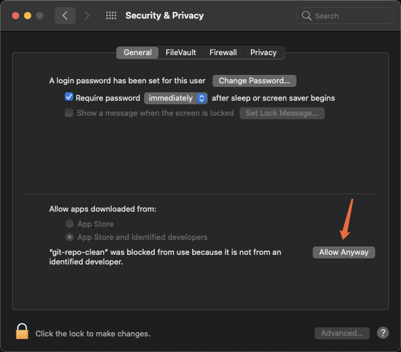
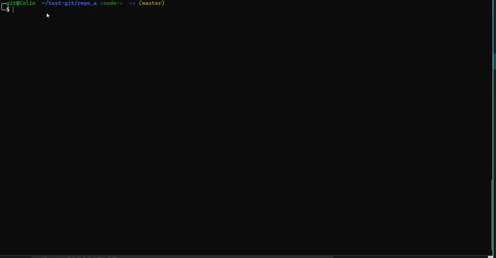
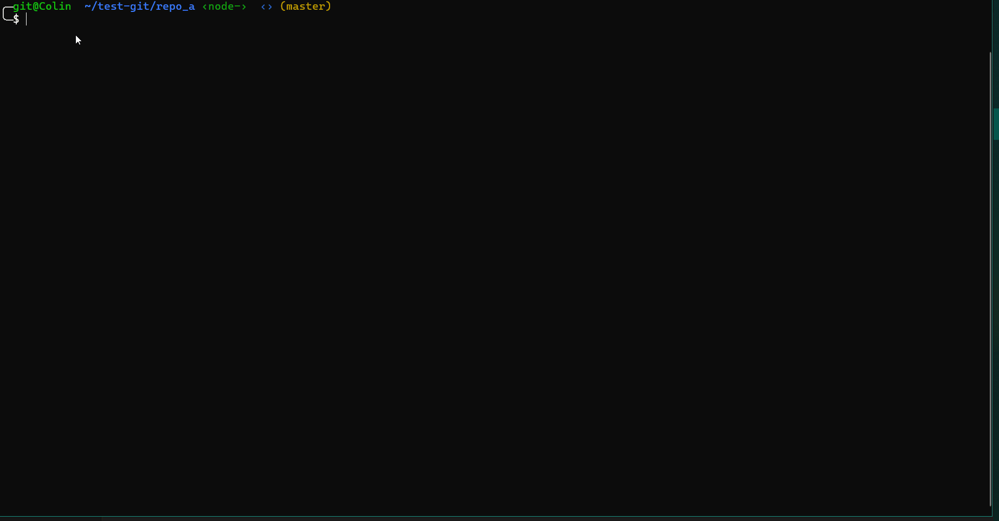

## 介绍

`git repo-clean`是用Golang开发的具备Git仓库大文件扫描，清理，并重写commit提交记录功能的Git拓展工具。

## 依赖环境：
+ Git >= 2.24.0  （必须）


## 安装
首先需要获得安装包，方式有两种：

**1. 二进制包安装**

下载链接：https://gitee.com/oschina/git-repo-clean/releases/

解压，即可进入加压后的目录，有如下文件：
```bash
-rwxrwxr-x 1 git git 6.3M Dec  1 17:31 git-repo-clean.exe   # 程序包（此为Windows下的程序包，其它平台类似）
-rw-rw-r-- 1 git git 5.1K Dec  1 17:31 README.md            # 使用文档（即本文档）
drwxrwxr-x 3 git git 4.0K Dec  1 17:31 docs                 # 附录文档
-rw-rw-r-- 1 git git 9.6K Dec  1 17:31 LICENSE              # 许可证

```
解压后，并不是直接点击`git-repo-clean.exe`就能用，而是需要经过下面的安装步骤才能使用。


**2. 源码编译安装包**

该方式需要你的电脑有基本的Golang开发环境
+ Golang >= 1.15

安装网址：https://docs.studygolang.com/doc/install

```bash
$ git clone https://gitee.com/oschina/git-repo-clean
# 进入源码目录，编译
$ cd git-repo-clean
$ make
# 在bin/目录下即是编译后的程序包
```

如果make时提示 i/o timeout 请尝试更换国内代理
> go env -w GOPROXY=https://goproxy.cn,direct

+ 安装

**1. Linux环境**

> sudo cp git-repo-clean $(git --exec-path)

**2. Windows环境**

方法一：将可执行文件`git-repo-clean.exe`的路径放到系统$PATH路径中，大致操作步骤为：
点击Windows的[开始] --> 输入`path` --> 选择`编辑系统环境变量`--> 选择`环境变量<N>` --> 在`系统变量(S)`中选择`Path` --> 选择`新建(N)` --> 将刚才解压的包含`git-repo-clean.exe`文件的`路径`复制到新建的环境变量中。

方法二：也是将`git-repo-clean.exe`复制到 Git 的执行目录下：`cp git-repo-clean.exe $(git --exec-path)`。(Git可能安装在C盘某个目录中，需要特别权限才能复制)

方法三：也可以直接复制该可执行文件`git-repo-clean.exe`到`C:\Windows\system32`目录下。(不推荐使用该方法，因为可能会误操作，导致系统文件被破坏)


**3. Mac OS环境**
与Linux上的操作类似。
但是注意：在`Mac OS`上进行配置之后可能无法执行，需要授权，具体方式为：
**System Preferences** -> **Security & Privacy**
点击 Allow Anyway 始终允许即可:



通过方法安装完成后，执行如下命令检测是否安装成功：
> git repo-clean --version

## 使用

有两种使用方式，一种是命令行，一种是交互式。

目前选项有如下：
```bash
  -v, --verbose		显示处理的详细过程
  -V, --version		显示 git-repo-clean 版本号
  -h, --help		显示使用信息
  -p, --path		指定Git仓库的路径, 默认是当前目录，即'.'
  -s, --scan		扫描Git仓库数据，默认是扫描所有分支中的数据
  -f, --file		直接指定仓库中的文件或目录，与'--scan'不兼容
  -b, --branch		设置需要删除文件的分支, 默认是从所有分支中删除文件
  -l, --limit		设置扫描文件阈值, 比如: '--limit=10m'
  -n, --number		设置显示扫描结果的数量
  -t, --type		设置扫描文件后缀名，即文件类型
  -i, --interactive 	开启交互式操作
  -d, --delete		执行文件删除和历史重写过程
  -L, --lfs		将大文件转换为Git LFS指针文件
```


**交互式用法:**

> 输入`git repo-clean`可以直接进入交互模式
该方式进入交互模式，因为没有加任何参数，只能使用默认选项。此模式下默认打开的选项有`--scan`, `--delete`, `--verbose`，如果想使用其它选项，如`--branch`，则可以使用如下方式：

`git repo-clean -i[--interactive]`
> 使用`-i` 选项进入交互式模式，该方法可以追加其它选项，如`git repo-clean -i --branch=topic`





**命令行式用法:**

`git repo-clean --verbose --scan --limit=1G --type=tar.gz --number=1`
> 在仓库中使用命令行，扫描仓库当所有分支中的文件，文件最小为1G，类型为tar.gz，显示前1个结果

`git repo-clean --verbose --scan --limit=1G --type=tar.gz --number=1 --delete`
> 加上`--delete`选项，则会批量删除扫描出的文件，并重写相关提交历史(包括HEAD)

如果想要清理其他分支的数据，可以使用`--branch`选项。默认`--branch=all`进行全扫描，会把所有分支上筛选出的数据清理掉。
`git repo-clean --verbose --scan --limit=1G --type=tar.gz --number=1 --delete --branch=dev`
> 加上`--branch=dev`选项，则只会删除`dev`分支中的指定文件，并重写相关提交历史。

如果确定了要删除的文件，也可以不使用`--scan`扫描模式，扫描模式会消耗大量时间进行仓库全量扫描。 经过重构，现在可以跳过前面的扫描过程，直接向程序指定文件或者文件夹进行删除、重写历史操作。使用选项`--file <filepath>`即可调用该功能。
`git repo-clean --verbose --file file1 --file dir/ --delete`
> 使用`--file <filepath>`删除指定文件，或者指定文件夹中的所有文件。

也可以不用扫描，只指定文件大小的阈值，即可从仓库中完成删除大小超过指定阈值的文件。<br/>
`git repo-clean --verbose --limit=1G --delete`
> 此时，`--number`选项无意义，默认值转为`UINT_MAX`。




**注意：**

+ 目前扫描操作和删除操作都是默认在所有分支上进行，而`--branch`选项只是指定删除时的分支，不能指定扫描时的分支。因此如果使用了这个选项指定了某个分支，可能从扫描结果中选择了另一个分支中的文件，因此不会有文件真正被删除。


## Git LFS(Git Large File Storage)
> 关于Git LFS, 参考：https://gitee.com/help/articles/4235

`git-repo-clean`从`v1.3.0`开始支持将扫描出来的历史大文件直接转化为`Git LFS`指针文件。如果用户开通了`Gitee LFS`功能，则可以将大文件上传到Gitee的LFS服务器单独存储，而 Git仓库只需要管理一份转换后很小的LFS指针文件。
LFS指针文件代替了原始文件存储在Git仓库`.git/objects/`中，而原文件存储在`.git/lfs/objects/`目录中，Git仓库不管理该目录，上传时该目录中的文件将上传到单独的LFS存储仓库。

在完成转换后，直到推送到远程之前，用户需要在本地安装`git lfs`工具，用来安装相关的钩子，如`pre-push`，这样在推送时，才会将`LFS`对象上传到`Gitee LFS`服务器。
> `git lfs`的安装，参考：https://github.com/git-lfs/git-lfs#downloading

目前只能在扫描模式下并且必须指定文件类型才能使用LFS功能，如：
`git repo-clean --verbose --scan --limit=100M --type=so --delete --lfs`
这条命令会将仓库中的大于`100 MB`的`.so`文件转化为不超过`200 Bytes`的LFS指针文件，极大的节省仓库空间。


## 代码结构

+ main.go       | 程序主入口
+ options.go    | 程序选项参数处理
+ cmd.go        | 交互式命令处理
+ color.go      | 颜色显示模块
+ repository.go | 仓库扫描相关处理
+ fastexport.go | 启动git-fast-export进程
+ fastimport.go | 启动git-fast-import进程
+ parser.go     | 仓库数据解析
+ filter.go     | 仓库数据过滤
+ git.go        | Git对象相关
+ utils.go      | 一些有用帮助函数
+ lfs.go        | 处理Git LFS相关的函数


## TODO
- [ ] 支持在同一个选项中有多个选择，如：--type=jpg, png, mp4
- [ ] 增加处理过程的进度提示信息，时间消耗信息等
- [ ] 对用户提供的仓库做进一步检测，如检测`.git`与工作目录是否分离
- [ ] 重构i18n模块，使用文件加载的方式
- [ ] 实现Windows下一键安装
- [ ] 升级Golang
- [ ] 升级Git

## BUG
+ 如果仓库中存在nested tag, 则在清理过程中会出现错误，如：`error: multiple updates for ref 'refs/tags/v1.0.1-pointer' not allowed`, 这会导致文件删除失败。暂时处理方式是一旦检测到这种情况，就退出程序，并显示警告信息。
+ 如果是在非扫描模式下指定历史版本中存在的文件路径或者文件类型进行删除，可能需要多次操作，才能完全删除。

## NOTE
+ 目前只关注文件本身，所以扫描时只关注blob类型对象
+ 从Git 2.32.0起，`git-rev-list`具备`--filter=object:type`选项，在扫描时能够过滤特定类型，这样能够加快处理过程，后续考虑使用较新的Git版本。

+ 以下参数单独使用是无效的：`--branch`, `--scan`, `--verbose`, `--delete`, 需要结合其它参数一起使用。


## 常见问题 Q&A

Q：
在Windows上使用git Bash终端，运行软件时，如`git repo-clean --version`，中文显示乱码。

A：
应该是终端的本地化配置问题，需要检查终端的本地化配置：在git Bash终端鼠标右键，找到底部`Options`选项，选择里面的文本`Text`选项，在`Locale` 下拉框中选择`zh_CN`, 在右边的字符集(Character set)选择中选择`UTF-8(Unicode)`。
如果设置成功之后，还是显示乱码，建议使用PowerShell终端。

Q:
Win10 交互式模块运行失败, 见 [issue](https://gitee.com/oschina/git-repo-clean/issues/I53TF0)

A:
在Windows某些终端，如git bash (Mingw64)确实可能会出现这个问题，来源于git-repo-clean使用的第三方依赖库 [survey](https://github.com/AlecAivazis/survey/issues/148)，解决方法是换个终端，如普通命令行Command Prompt，或Windows PowerShell。

Q：
删除不成功。使用`git repo-clean`删除文件后，再次进行扫描，结果发现文件还是存在。

A：
首先可能是同一个文件存在多个历史版本，在扫描结果中，它们的文件ID是不同的。扫描时，如果不指定`--number`选项，则默认只显示，并将只删除前3个文件。所以当同一个文件存在多个版本时，第一次只删除了其中3个，第二次扫描显示的是另外的3个版本。
其次，该文件可能存在与其它分支中，当前扫描是全量全分支扫描，但是删除时，是选择了删除当前分支的文件。所以如果发现删除的文件还存在，可以不知道特定分支，而是默认进行全部分支的删除。

Q：
删除后，推送仍然失败。

A：
在推送时，会计算服务端仓库剩余大小，再加上本地仓库大小，总和如果还是超出限额，推送就还是会被拒绝。
建议在本地文件清理足够干净时再尝试推送。如果发现服务端仓库已经超出限额，请先在Web端进行手动GC操作，如果仓库大小还是超额，联系客服进行处理。


Q:
删除不成功。 使用`git repo-clean --file build/ --delete`删除指定目录，发现文件一直存在。

A:
如果出现提示：`没有文件更改，退出...`， 则是因为`build`目录虽然在工作目录中，但并没有加入到Git仓库中，可以查看`.gitignore`文件内容进行验证。其它情况，请尝试再次运行该命令。


## 技术原理
见 [docs/technical.md](docs/technical.md)

## Contribute

有任何问题，可以提交 [issue](https://gitee.com/oschina/git-repo-clean/issues)讨论,

或者有好的改进点、特性点，可以提交 [PR](https://gitee.com/oschina/git-repo-clean/pulls)，流程如下：
1. Fork 本仓库
2. 新建 Feat_xxx 分支
3. 提交代码
4. 新建 Pull Request


## License
git repo-clean is licensed under [Mulan PSL v2](LICENSE)


